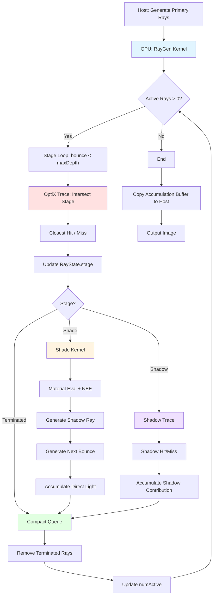
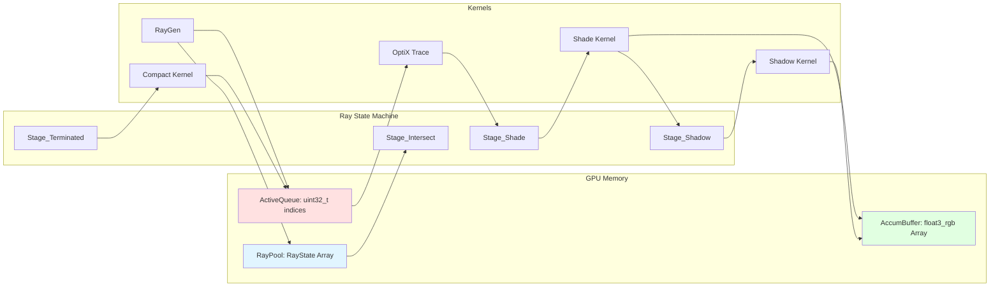

# libVLRW

**VLR Wavefront**：与 **libVLR** 并列的 Wavefront Path Tracing 渲染核，RGB 工作流，基于 OptiX。面向建筑表现 GPU 离线渲染器（类 V-Ray）的演进路线。

- **架构**：Wavefront（RayGen → Intersection → MaterialEval → ShadowRay → Accumulate），非 Megakernel。
- **光谱**：仅 RGB。
- **依赖**：OptiX 9.1、CUDA 13.1；不依赖 libVLR。
- **标准**：C++20（使用 `std::span`、`std::string_view`，为 Taskflow 集成做准备）

## Wavefront 渲染流程



## 数据流架构



## 与 libVLR 的关系

- **libVLR**：现有 Megakernel + 光谱 渲染库，保留。
- **libVLRCore**：新文件夹、新管线，按 [18 个月架构蓝图](../docs/architecture_blueprint_18m.md) 分阶段实现。

## 与 libVLR 的分工

- **libVLR**：现有 Megakernel + 光谱渲染库（保留）
- **libVLRW**：新 Wavefront + RGB 渲染库（独立实现）
- **HostProgram**：应用层（加载资源、构建场景、UI、输出），可调用 libVLR 或 libVLRW

详见 [架构分工设计](../docs/architecture_separation.md)。

## 目录

- `include/vlrw/` — 对外 API 与类型
- `gpu/` — Wavefront 队列内核（ray gen、trace、shade、compact）
- `src/` — 主机端（OptiX 上下文、场景、Wavefront 调度）

## 阶段对应（见蓝图）

- **阶段 0（已完成）**：技术决策、pipeline/队列/数据结构草案 → 本库骨架与设计文档。详见 [阶段 0 总结](../docs/stage0_summary.md)。
- **阶段 1（进行中）**：基础 Wavefront PT、队列拆分、Payload 改造、基础材质、MIS+NEE。详见 [开发路线图](../docs/development_roadmap.md)。
- 后续阶段见 [18 个月架构蓝图](../docs/architecture_blueprint_18m.md)。

## 当前状态（迭代 1：多 Kernel Wavefront）

- ✅ **RayState 状态机模型**：stage（Intersect/Shade/Shadow/Terminated）驱动
- ✅ **多队列 index 管理**：activeQueue、nextQueue、shadowQueue、shadeQueue
- ✅ **GPU 内核**：intersectStage、shadeStage、shadowStage、compactQueue
- ✅ **材质系统**：Diffuse/GGX/Dielectric/Emissive（GGX/Dielectric 占位）
- ✅ **NEE/MIS**：power heuristic、shadow ray 独立队列
- 🔲 **主机端**：OptiX context、Scene、WavefrontScheduler（阶段 1 实现）
- 🔲 **迭代 2**：Queue compaction + prefix sum（阶段 1 后期）
- 🔲 **迭代 3/4**：Material sorting + Persistent kernel（阶段 4）

## 参考文档

- [最优调度模型](../docs/wavefront_scheduler_optimal.md) — 理论与最终形态
- [开发路线图](../docs/development_roadmap.md) — 4 个迭代（多 kernel → persistent）
- [Pipeline 设计](../docs/wavefront_pipeline_design.md) — 队列与数据流

## 构建

### 环境要求

- **CUDA Toolkit**: 13.1+ (推荐 13.1)
- **OptiX SDK**: 9.1.0 (支持 8.0+)
- **GPU 架构**: compute_75+ (Turing/Ampere/Ada, 如 MX550, RTX 系列)
- **编译器**: Visual Studio 2022 (MSVC 19.38+)
- **CMake**: 3.26+
- **C++ 标准**: C++20

### CMake 配置命令

```powershell
# 完整配置（推荐）
cmake -B build `
  -G "Visual Studio 17 2022" `
  -A x64 `
  -T "cuda=C:\Program Files\NVIDIA GPU Computing Toolkit\CUDA\v13.1" `
  -DOptiX_INSTALL_DIR="C:\ProgramData\NVIDIA Corporation\OptiX SDK 9.1.0"

# 编译 libVLRW 库
cmake --build build --config Release --target libVLRW

# 编译测试程序
cmake --build build --config Release --target cornell_box_test
```

### 测试

```powershell
# 运行 Cornell Box 测试
.\build\bin\Release\cornell_box_test.exe
# 输出: cornell_box.png
```

## 常见编译问题

详见 [.cursor/rules/libvlrw-build.mdc](../.cursor/rules/libvlrw-build.mdc)
